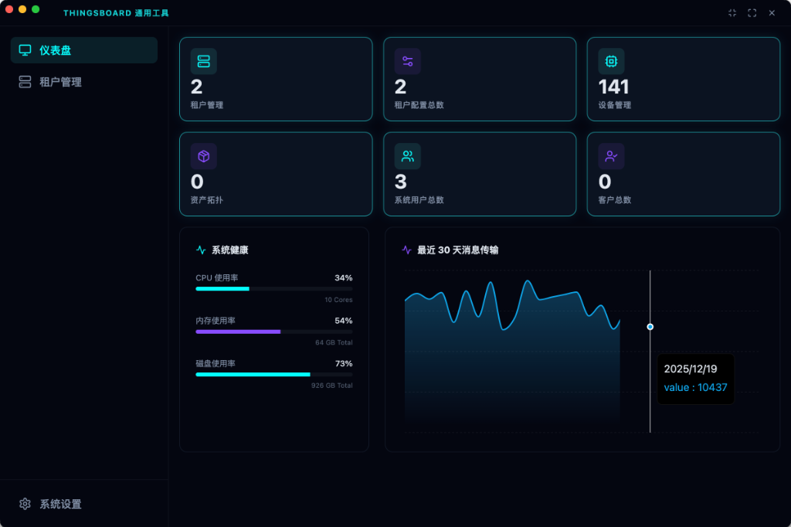
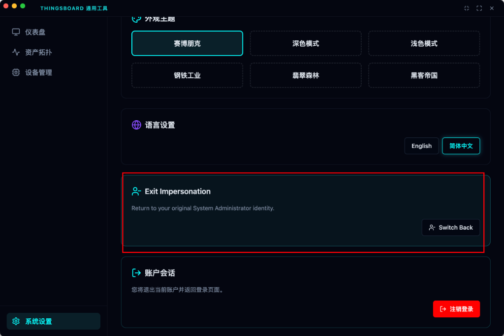
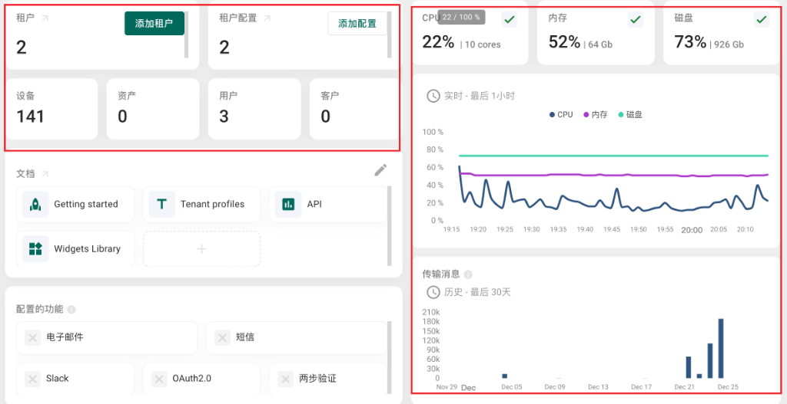
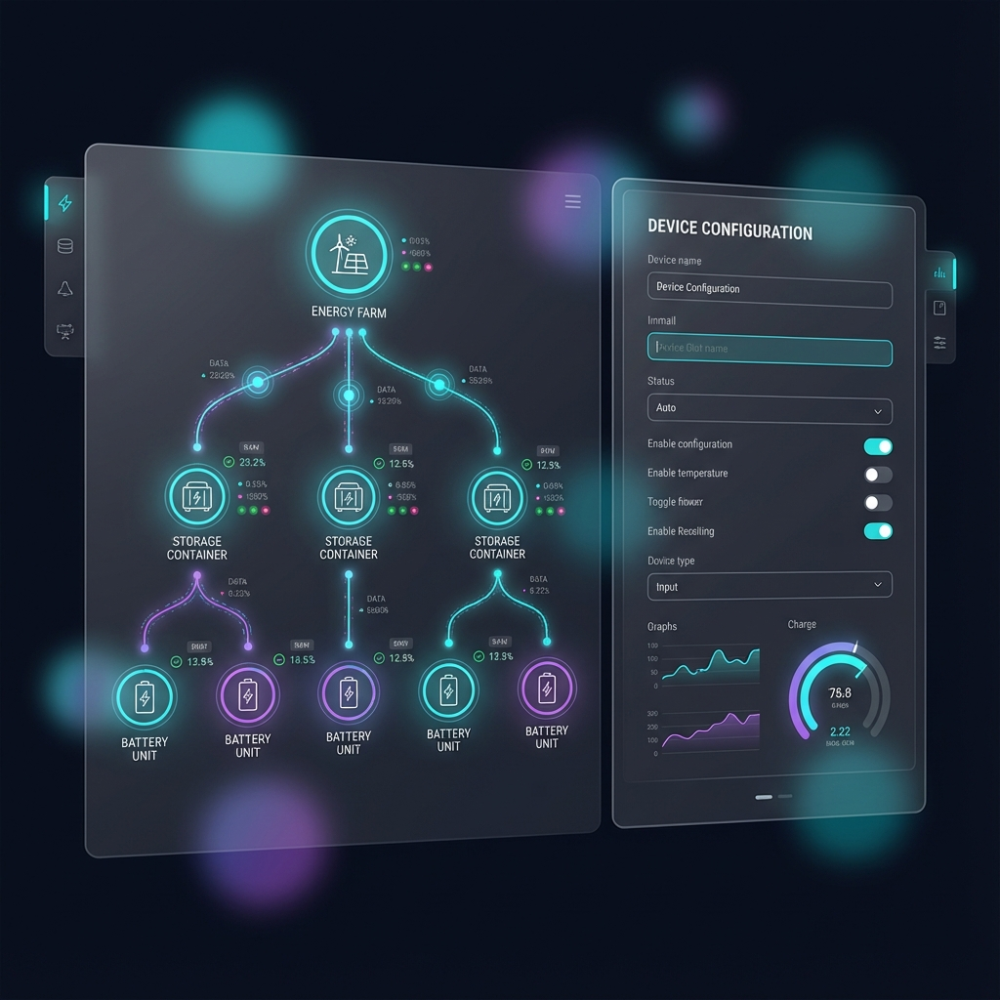

# ThingsBoard 通用工具 (ThingsBoard Universal Tool)


**专为 ThingsBoard 工程师打造的高性能、跨平台通用交付工具。**

基于 Electron + React + TypeScript 构建，融合了深色赛博工业美学（Cyber-Industrial Aesthetics），旨在为现场交付与运维提供一个可视化、高效、沉浸式的管理环境。



---

## 🌟 核心特性 (Core Features)

### 1. 赛博工业美学 UI

深度定制的 "Glassmorphism" 玻璃拟态风格，内置多套主题（赛博朋克、暗黑、明亮、工业灰、黑客帝国），支持一键切换。



### 2. 多环境与租户管理

- **多实例切换**: 轻松管理开发、测试、生产等多个 ThingsBoard 环境。
- **租户列表**: 高密度的租户管理视图，支持快速搜索与状态监控。
- **Magic Jump**: 独家的“免密跳转”功能，系统管理员可一键以任意租户身份进入 Web Dashboard，无需重新登录。



### 3. 可视化资产拓扑

- **React Flow 集成**: 以树状图形式直观展示 `租户 -> 资产 -> 设备` 的层级关系。
- **拖拽编排**: 支持交互式操作，清晰梳理复杂的物联网资产脉络。



### 4. 高级设备管理

- **高密度列表**: 专为海量设备设计的紧凑型列表视图。
- **实时状态**: 直观展示设备的活跃/离线状态。
- **凭证管理**: 智能解析 MQTT Basic、Access Token 等多种凭证格式，支持一键复制。

### 5. 国际化支持

原生支持 **简体中文 (zh-CN)** 与 **English (en-US)**，界面文案自适应切换。

## 🛠 技术栈 (Tech Stack)

- **核心框架**: Electron 28, Vite 5
- **前端技术**: React 18, TypeScript
- **状态管理**: Zustand, React Query
- **界面样式**: Tailwind CSS, Radix UI, Framer Motion
- **可视化**: React Flow, Recharts

## 🚀 快速开始 (Getting Started)

### 前置要求

- Node.js >= 18.0.0
- npm 或 yarn

### 安装步骤

1. **克隆仓库**

   ```bash
   git clone https://github.com/bcblr1993/thingsboard-universal-tool.git
   cd thingsboard-universal-tool
   ```

2. **安装依赖**

   ```bash
   npm install
   ```

3. **启动开发环境**

   ```bash
   npm run dev
   ```

   此命令将同时启动 Vite 开发服务器和 Electron 主窗口。

4. **构建发布包**

   ```bash
   npm run build
   ```

   构建产物（如 .dmg, .exe）将输出到 `dist` 目录。

## 🤝 贡献指南 (Contributing)

非常欢迎提交 Pull Request 或 Issue！

1. Fork 本项目
2. 创建特性分支 (`git checkout -b feature/AmazingFeature`)
3. 提交改动 (`git commit -m 'Add some AmazingFeature'`)
4. 推送到分支 (`git push origin feature/AmazingFeature`)
5. 提交 Pull Request

## 📄 开源协议 (License)

本项目基于 [MIT License](LICENSE) 开源。

---

**作者**: Chen Yannan
